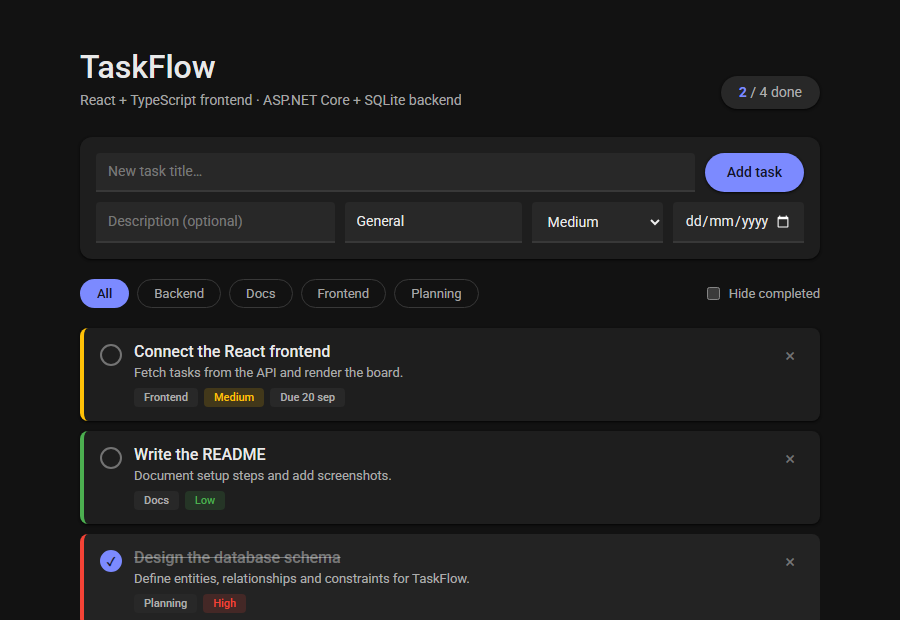
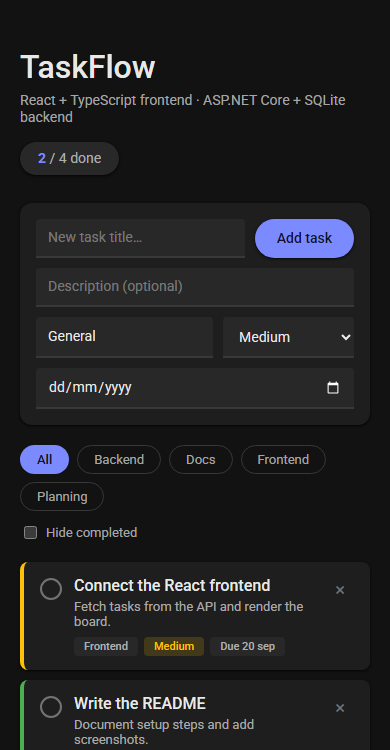

# TaskFlow

A small full-stack task manager built to practice a clean React + .NET setup end to end: a typed REST API backed by SQLite, and a React frontend that consumes it. UI follows a flat, Material Design–inspired dark theme — solid surfaces, elevation shadows instead of blur, and Material's color/typography system.




<details>
<summary>Mobile view</summary>



</details>

## Stack

| Layer    | Tech                                                |
| -------- | ---------------------------------------------------- |
| Frontend | React 19, TypeScript, Vite                            |
| Backend  | ASP.NET Core Web API (.NET 10), C#                     |
| Data     | Entity Framework Core + SQLite                         |
| Other    | CORS, EF Core migrations, seeded sample data            |

## Design

The UI leans on core Material Design principles adapted to a flat aesthetic:

- **Flat surfaces, no blur** — cards and inputs use solid dark surface colors (`#1e1e1e`–`#2e2e2e`) instead of glassmorphism/backdrop-filter.
- **Elevation over transparency** — depth comes from layered `box-shadow` recipes (Material's 1dp/2dp/4dp elevation levels), not blur or opacity.
- **Material color roles** — a single primary accent plus semantic colors (`success`/`warning`/`error`) drive priority tags and state, all defined as CSS custom properties.
- **Roboto** as the type family, Material's default.

## Features

- Create, complete, and delete tasks
- Category and priority (Low / Medium / High) per task
- Optional due date, with overdue tasks flagged in the UI
- Filter by category and hide completed tasks
- Optimistic UI updates (toggling/deleting feels instant, rolls back on API failure)
- Typed API client on the frontend, typed DTOs on the backend — the same task shape flows through both ends

## Project structure

```
taskflow/
├── server/          ASP.NET Core Web API
│   ├── Controllers/ TasksController (REST endpoints)
│   ├── Models/       TaskItem entity + TaskPriority enum
│   ├── Data/          EF Core DbContext + seed data
│   ├── DTOs/           Request/response shapes
│   └── Migrations/   EF Core migrations
└── client/           React + TypeScript (Vite)
    └── src/
        ├── api/        Typed fetch client
        ├── components/ TaskForm, TaskCard, FilterBar
        ├── types.ts    Shared Task/Priority types
        └── App.tsx     App state, filtering, data flow
```

## Running it locally

You'll need the [.NET SDK](https://dotnet.microsoft.com/download) (8+) and [Node.js](https://nodejs.org/) (18+).

**1. Backend** (runs on `http://localhost:5020`, applies EF Core migrations and seeds sample data automatically on first run):

```bash
cd server
dotnet run
```

**2. Frontend** (runs on `http://localhost:5173`):

```bash
cd client
npm install
npm run dev
```

Open `http://localhost:5173` — the app fetches tasks from the API on load.

> The frontend's API base URL defaults to `http://localhost:5020/api`. Override it with a `VITE_API_URL` env var if you run the backend elsewhere.

## API

| Method | Route                    | Description                  |
| ------ | ------------------------- | ----------------------------- |
| GET    | `/api/tasks`                | List tasks (`?category=`, `?isCompleted=`) |
| GET    | `/api/tasks/{id}`            | Get a single task              |
| POST   | `/api/tasks`                | Create a task                   |
| PUT    | `/api/tasks/{id}`            | Replace a task                  |
| PATCH  | `/api/tasks/{id}/toggle`    | Toggle completion               |
| DELETE | `/api/tasks/{id}`            | Delete a task                    |

## Possible next steps

- User accounts + JWT auth (multi-user boards)
- Drag-and-drop reordering
- Integration tests for the API (WebApplicationFactory + xUnit)

---

Built by [RodX](https://rodx75.github.io/Rodx/) — [portfolio](https://rodx75.github.io/Rodx/)
